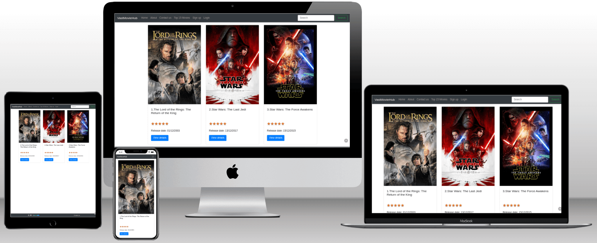

# VastMovieHub



The VastMovieHub has been developed for my PP4 for Code Institute. At the VastMovieHub the user can search for a movie, see top 15 movies and view a movie's details.
A registered user can also add/delete movies to their favourites list, comment on a movie and edit/delete their comment and give rating to a movie.

This website uses [TMDB](https://www.themoviedb.org/) and the TMDB APIs but is not endorsed, certified, or otherwise approved by TMDB.

 

[View the deployed project here](https://moviehub-vas-2ed6679610a9.herokuapp.com/)

## Contents

* [Design](#design)
  * [Colour Scheme](#colour-scheme)
  * [Typography](#typography)
  * [Wireframes](#wireframes)
* [User Experience (UX)](#user-experience-ux)
  * [Agile methodology](#agile-methodology)
  * [User Stories](#user-stories)
* [Database Diagram]
* [Features](#features)
  
* [Technologies Used](#technologies-used)
  * [Languages Used](#languages-used)
  * [Frameworks, Libraries & Programs Used](#frameworks-libraries--programs-used)
* [Deployment and Local Development](#deployment-and-local-development)
  * [Local Development](#local-development)
    * [How to fork](#how-to-fork)
    * [How to clone](#how-to-clone)
    * [Deployment](#deployment)
* [Testing](#testing)
* [Credits](#credits)

## Design

This project uses the Bootstrap Framework and I chose
to use the colours and fonts that it offers.

### Colour Scheme

   [buttons](/documentation/colors/btn-colors.png)

   [navbar](/documentation/colors/bg-dark.png)

### Typography

   Bootstrap's Native font stack

   [Read more about Native font stack](https://www.smashingmagazine.com/2015/11/using-system-ui-fonts-practical-guide/)

### Wireframes

#### Desktop

[Home Page Site user](/documentation/wireframes_diagrams/home_page.png)

[Navbar Registered User](/documentation/wireframes_diagrams/navbar_registered.png)

[About Page](/documentation/wireframes_diagrams/about.png)

[Contact page](/documentation/wireframes_diagrams/contact.png)

[Top 15 Movies](/documentation/wireframes_diagrams/top_rated.png)

[Login](/documentation/wireframes_diagrams/login.png)

[Signup](/documentation/wireframes_diagrams/signup.png)

[Results Page](/documentation/wireframes_diagrams/movie_list.png)

[Movie Page](/documentation/wireframes_diagrams/movie_details.png)

[Favourites Page](/documentation/wireframes_diagrams/favourites_page.png)

[Comments Page](/documentation/wireframes_diagrams/comment_page.png)

#### Mobile

[Home Page](/documentation/wireframes_diagrams/mobile_home.png)

[About Page](/documentation/wireframes_diagrams/mobile_about.png)

[Contact page](/documentation/wireframes_diagrams/mobile_contact.png)

[Top 15 Movies](/documentation/wireframes_diagrams/mobile_top_rated.png)

[Login](/documentation/wireframes_diagrams/mobile_login.png)

[Signup](/documentation/wireframes_diagrams/mobile_signup.png)

[Results Page](/documentation/wireframes_diagrams/mobile_movie_list.png)

[Movie Page](/documentation/wireframes_diagrams/mobile_movie_details.png)

[Favourites Page](/documentation/wireframes_diagrams/mobile_favourites.png)

[Comments Page](/documentation/wireframes_diagrams/mobile_comments.png)

## User Experience (UX)

## Agile Methodology

The Agile Methodology was used to plan this project. This was implemented through Github and the Project Board. Through the use of the Kanban board in the projects view in Github, the project was divided into a few different sections:

* To Do - (All the User stories were initially entered in the 'To Do' column)
* In Progress - (then during development story they were moved into the 'In Progress' column)
* Done - (then finally they get moved into 'Done' once the development completes)
* Future features - (User stories to be implemented in the future)

Please find my Kanban Board with my user stories [here](https://github.com/users/Vasileios20/projects/5).

### User Stories

* As a Site Admin I can approve comments so that I can filter out objectionable comments.
* As a Site User I can register an account so that I can comment and give rating to a movie and create favourites list.
* As a Site User I can visit an about page so that I can find more information about the site.
* As a Site User I can write a message to a contact form so that I can communicate with the admin.
* As a Site User I can search for a movie so that I can find more about the movie.
* As a Site User I can visit a page so that I can view the top rated movies.
* As a Site User I can view movie details so that I can find more details about the movie.
* As a Site User I can view the most popular movies so that I can discover what movies are trending to watch.
* As a Site User I can view the upcoming movies so that I can discover new movies.
* As a Registered User I can view comments on a movie so that I can read the conversation.
* As a Registered User I can access a webpage where I can comment on a movie so that I can be involved in the conversation.
* As a Registered User I can click to add a movie to my favourites list so that I can have my favourites movies organised.
* As a Registered User I can click to remove a movie from my favourites so that I can update my favourites list.
* As a Registered User I can add rating to a movie so that I can express how much I liked a movie.
* As a Registered User I can delete comments from a movie so that manage the content on the platform more effectively.
* As a Registered User I can edit my comments so that manage the content on the platform more effectively.

## Database Diagram

[Database Diagram](/documentation/wireframes_diagrams/DBdiagram.png)

## Features


## Technologies Used

### Languages Used

### Frameworks, Libraries & Programs Used

#### Libraries Used

#### Programs Used

## Deployment and Local Development

### Local Development

When in development navigate to the settings.py and change the following variables to:

* To view code errors

```python
DEBUG = True
```

* To view emails in the terminal

```python
EMAIL_BACKEND = 'django.core.mail.backends.console.EmailBackend'
```

* To set the staticfiles storage

```python
STATICFILES_STORAGE = 'cloudinary_storage.storage.StaticHashedCloudinaryStorage'
```

#### How to fork

To fork the repository :

1. Log in (sign up) to GitHub.
2. Go to the repository for this project [MovieHub](https://github.com/Vasileios20/MovieHub).
3. Click the fork button in the top right corner.

#### How to clone

To clone the repository :

1. Log in (sign up) to GitHub.
2. Go to the repository for this project [MovieHub](https://github.com/Vasileios20/MovieHub).
3. Click on the code button, select one of the HTTPS, SSH or GitHub CLI and copy the link shown.
4. Open the terminal in your code editor and change the current working directory to the location you want to use for the cloned directory.
5. Type 'git clone' into the terminal and then paste the link you copied in step 3. Press enter.

### Deployment

The site has been deployed using Heroku. Deployed site [VastMovieHub](https://moviehub-vas-2ed6679610a9.herokuapp.com). Follow these steps:

#### ElephantSQL

If you don't already have an account to ElephantSQL, create one [here](https://www.elephantsql.com).

* Create an external database with

  * Log into ElephantSQL
  * Click "Create New Instance"
  * Set up a plan by giving a Name and selecting a Plan
  * Click "Select Region" and choose a Data center
  * Click "Review", check all details and click "Create Instance"
  * Return to the Dashboard and click on the database instance name
  * Copy the database URL

#### Heroku App

If you don't already have an account to Heroku, create one [here](https://www.heroku.com/).

* Create Heroku app
  * Go to the Heroku dashboard and click the "Create new app" button.
  * Name the app. Each app name on Heroku has to be unique.
  * Then select your region.
  * And then click "Create app".

#### Attach the Database

* In the IDE file explorer or terminal
  * Create new env.py file on top level directory

* In env.py
  * Import os library
  * Set environment variables
  * Add database url
  * Add in secret key
  * Add TMDB API KEY
  * Add email address
  * Add email password

```python
import os

os.environ["DATABASE_URL"] = "Paste in ElephantSQL database URL"    
os.environ["SECRET_KEY"] = "Make up your own randomSecretKey"    
os.environ["TMDB_API_KEY"] = "Your TMDB API key"    
os.environ["EMAIL_ADDRESS"] = "Your email address"
os.environ["EMAIL_PASSWORD"] = "Your email password"
os.environ["CLOUDINARY_URL"] = "Paste in the API Environment variable"
```
  
If you don't already have an account to Cloudinary, create one [here](https://cloudinary.com/).

* Cloudinary
  * Go to the Cloudinary dashboard and copy the API Environment variable.
  * Paste in env.py variable CLOUDINARY_URL(see above)
  
* In heroku app
  * Go to the settings tab.
  * In the settings click the button "Reveal Config Vars".
  * Click Add and use

    |KEY|VALUE|
    |--|--|
    |PORT|8000|
    |DATABASE_URL|Paste in ElephantSQL database URL|
    |SECRET_KEY|Your own randomSecretKey|
    |TMDB_API_KEY|Your TMDB API key|
    |EMAIL_ADDRESS|Your email address|
    |EMAIL_PASSWORD|Your email password|
    |CLOUDINARY_URL|Paste in the API Environment variable|

  * Go to the deploy tab.
  * Choose the deployment method.
  * Select Github, and confirm to connect to Github.
  * Search for the Github repository name.
  * Then click "connect".
  * Scroll down and click "Deploy Branch".

## Testing

## Credits

### Code Used

### Media

### Aknowledgments
